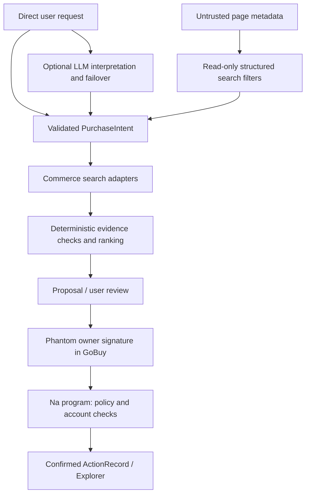

# GoBuy + Na architecture v2

This is an incremental refactor of the existing repository. The web app, research cards, Commerce Twin, demo image upload, Phantom connection, Devnet confirmation guards, immutable action PDAs, search evidence checks, and transaction Explorer links remain in place. Existing local `.env` files were not changed.

## Existing architecture and changes

| Layer | Existing implementation | v2 change |
| --- | --- | --- |
| Web | React/Vite, research conversation, authority demo, mandate form, activity | Structured search, provider label, extension pairing, action history, no price in policy |
| Backend | Express, anonymous cookie sessions, research service, bounded search, deterministic verification/ranking, file-backed Twin | Paired extension sessions, short research jobs, Anthropic, deterministic outage fallback, fixed sneaker inventory, Ondo feed adapter |
| Shared | Zod contracts, canonical policy/proposal hashes, local rule previews | Request-scoped `PurchaseIntent`, page-context/action schemas, v2 policy/proposal encoding |
| Wallet | Phantom public-address connection; user signs all Devnet transactions | Same trust boundary; extension opens the web app for wallet review |
| Anchor | Undeployed authorization/audit program; owner signatures, version checks, immutable action IDs | Active/revoked policy, collection/protocol/risk checks, no permanent amount limit, fixed treasury validation and fee quotation |
| Extension | None | Manifest V3 popup, side panel, user-invoked page extraction, authenticated API client |

There was **no existing asset execution, agent signing wallet, fee collection, or Ondo integration**. v2 does not claim to purchase or custody assets. No agent key is created: the backend is a proposal identity, with no unrestricted user-wallet access.

## Trust and request flow



The extension never signs or invokes wallet code. It extracts bounded title, URL, optional price meta tags and a Magic Eden collection symbol, only after the user invokes inspection. It reads no page body, cookies, form fields or hidden wallet state. All extraction is `UNTRUSTED_EXTERNAL_CONTENT`. Page content never enters an LLM instruction, cannot grant BUY authority, and is not accepted as marketplace evidence. API records still need their own validation. React renders extracted text as text, never HTML.

### Request budget vs persistent policy

`shared/src/intent.ts` defines `PurchaseIntent` with `requestId`, `assetType`, `query`, optional `budget`, and validated preferences. Currency supports SOL, USDC, USD and the existing fiat research currencies. The old checkout-shaped `PurchaseIntent` is now `PreparedPurchase`; it remains behind the existing disabled payment boundary.

Natural language uses validated model output when available and deterministic explicit spending constraints. Structured search bypasses all LLMs. Explicit request budgets override model output and are never silently increased. Neither a new request nor a FIND request inherits a Commerce Twin maximum. A budget update references the previous session-owned search; it does not update the mandate.

The fixed sneaker demo has Jordan 1 offers at $242 and $265. An under-$200 request returns no match. Mock inventory never changes its prices to fit a budget, and synthetic sellers/authenticity are never represented as verified real-world facts.

**Off-chain budgets are not on-chain spending limits.** The current program is authorization/audit only. Before enabling delegated spending, implement an owner-signed transaction intent binding chain/program, owner, mandate/version, request ID, exact asset/mint, maximum integer amount, token mint, recipient, treasury, expiry and nonce. On-chain signature verification must bind these exact fields, atomically consume the nonce, validate token/program accounts, and execute the transaction in the same instruction. A preflight approval alone is insufficient. This stronger signed-intent execution design is documented, not implemented.

### Solana policy v2

The on-chain mandate contains owner, version, active state, risk level, collection/protocol allowlists (up to eight each), the existing asset/marketplace/seller/autonomy rules, and a canonical hash. Empty collection lists deny all NFT collections. Unchecking **Active mandate** and signing the update revokes the policy.

Owner signatures and PDA/account-owner constraints remain enforced by Anchor. The protocol account must match the signed proposal and be executable. Currency substitution is rejected; this program supports only its original Devnet demo currency. Collection/risk/seller fields remain owner-signed facts: the program does not attest marketplace claims or verify an NFT metadata collection. Mainnet NFTs and physical products are not silently routed into demo transactions. RWA execution remains denied.

The new PDA uses `["mandate-v2", owner]`. Old policy accounts are not mutated or interpreted as v2. Both canonical hash domains are v2. Old IDLs are incompatible; rebuild and copy the generated IDL. Old audit accounts remain on chain. The current UI loads v2 history; v1 records must be inspected with their original IDL.

Fee **quotes** use integer arithmetic: NFT 30 bps (0.3%), RWA 10 bps (0.1%), rounded down in base units. The compiled treasury address is checked independently of the client. No quote is a charge and no fee is collected on a rejection. Configure an actual public treasury before any deployment; `[2; 32]` is the undeployed sentinel. No user funds are sent there.

## LLM and commerce providers

`LLMRouter.generate()` supports OpenAI, Anthropic, Gemini, Groq and optional Ollama. `LLM_PROVIDER_ORDER` determines priority. Missing keys skip providers. Quota, ordinary 429 rate limiting, authentication, timeout, server, malformed output, context, refusal and application failures remain distinct. Only malformed model JSON receives one repair attempt. Repeated provider failures open a cooldown circuit; application/authorization errors do not trigger provider failover. Logs contain provider/category/timing metadata, not raw provider bodies or secrets.

All-provider unavailability activates the limited deterministic parser and displays:

> AI reasoning is temporarily unavailable. Search and on-chain validation are still available.

Structured search remains the precise alternative for unsupported language. Wallet connection, policy editing, audit reading and Solana calls have no LLM dependency. Live search failures never activate mock inventory. The UI labels which provider interpreted the intent and whether failover occurred; explanations may independently fall back to deterministic reasons.

Existing `SearchProvider` adapters remain behind `SearchAggregator`, with bounded requests, schema checks, URL deduplication, failure isolation and circuit breakers. `CommerceProviderAdapter` offers the request-scoped interface for additional integrations. The existing deterministic ranker retains configurable `RANKING_WEIGHTS_JSON` weights and filters unmet hard requirements before scoring.

Magic Eden's existing read-only collection API now requires a seller/mint and carries listing status and collection-address evidence when returned. Missing collection address prevents selection; a collection symbol alone is not authentication. An API outage or missing evidence can legitimately yield no match.

`OndoProvider` consumes an **operator-configured normalized HTTPS data gateway** through `ONDO_DATA_URL`. This repository does not assume an undocumented public Ondo yield endpoint. A deployment must source and normalize its authorized data upstream; setting this variable to a marketing webpage will not work. The JSON response is an array of:

```json
{
  "token": "USDY",
  "name": "USDY",
  "network": "Solana",
  "price": 1.1,
  "currency": "USD",
  "sourceUrl": "https://ondo.finance/usdy",
  "apy": 4,
  "apySource": "https://ondo.finance/usdy",
  "observedAt": "2026-09-29T00:00:00.000Z",
  "riskLevel": 1,
  "risks": ["Issuer, eligibility and redemption risks"]
}
```

These numbers are **schema examples, not current prices or yields**. Rows older than 24 hours, future timestamps, unsupported networks and APYs without sources are discarded. Risk is source metadata rather than a guarantee; explicit low-risk requests filter out higher metadata levels. Verify legal eligibility and redemption restrictions outside this read-only demo.

## Action history and extension authentication

Search and review actions are written atomically with the browser's Twin data, capped at the latest 200 entries. Fields include timestamp, request/request ID, asset, known price/currency, source, status and reason. On-chain audit records are loaded independently for the connected wallet. Only real submitted transactions receive signatures and Explorer transaction links. A saved recommendation approval is a `PROPOSED` review, not `APPROVED` on-chain authority or an `EXECUTED` purchase.

The web app issues a cryptographically random, single-use pairing code valid for two minutes. Redemption binds a one-hour research token to the exact Chrome extension origin and the current anonymous research session. This proves possession of that workspace's pairing code, **not wallet ownership**. Tokens live only in `chrome.storage.session`, inaccessible to content scripts. Browser restart, expiry or revocation requires pairing again. No API key is embedded in a build or stored in browser localStorage.

The extension requests `activeTab`, `storage`, `sidePanel`, and `scripting`. The additional scripting permission enables inspection only after user activation; no persistent marketplace host grants or `<all_urls>` are requested. The sole persistent host grant is the configured GoBuy API origin. `POST /api/extension/jobs` starts research and authenticated GET polling retrieves it, avoiding Chrome's 30-second service-worker fetch-response limit. Popup closure/worker suspension does not stop server research; the popup can resume the saved job. Jobs and grants are process-local, bounded and expire. Multi-instance hosting requires a shared session/job store and service-wide rate limits.

## Run the web app

From the existing `gobuy` directory:

```powershell
npm ci
# Copy only if absent; preserve personal configuration.
if (!(Test-Path backend/.env)) { Copy-Item backend/.env.example backend/.env }
if (!(Test-Path frontend/.env.local)) { Copy-Item frontend/.env.example frontend/.env.local }
npm run dev:backend
# In a second terminal:
npm run dev
```

Open `http://localhost:5173/na`. For offline fixed inventory set `SEARCH_PROVIDER_MODE=mock` in backend/.env and restart. For live search configure Magic Eden, eBay, Brave or the Ondo gateway. LLM keys are optional, server-only. New settings are `ANTHROPIC_API_KEY`, `ANTHROPIC_MODEL`, `ONDO_DATA_URL`, and an order such as `LLM_PROVIDER_ORDER=openai,anthropic,gemini`. Existing Groq/Ollama/search/ranking settings remain accepted.

## Load Na Extension

```powershell
npm run build:extension
```

1. Open `chrome://extensions`, enable Developer mode and select **Load unpacked**.
2. Select the absolute `gobuy/extension/dist` directory.
3. In GoBuy open **My mandate → Na Extension → Generate extension pairing code**.
4. Open the Na popup and paste the code. Use **Open side panel** for persistent chat.
5. Open a supported HTTPS Magic Eden, Ondo, eBay or Nike page, invoke Na and choose **Inspect current page → Analyze with Na**. Restricted/unsupported pages are rejected.
6. **Phantom & policy** opens GoBuy for wallet connection, policy review and signing. No transaction runs in a content script.

Default origins are API `http://localhost:3001` and web `http://localhost:5173`. For another deployment set public build variables `GOBUY_API_ORIGIN` and `GOBUY_WEB_ORIGIN` in the shell before building. Production origins must be HTTPS. The build writes the exact API host/CSP grants; do not insert secrets. Set backend `APP_ORIGINS` for the web origin. Extension origins are authenticated through pairing rather than added to the web cookie allowlist.

## Validation and Anchor tests

```powershell
npm run build
npm run lint
npm test
$env:PLAYWRIGHT_CHANNEL = "msedge"
npm run test:e2e
cargo test --manifest-path anchor/Cargo.toml
```

After installing the Anchor/Solana toolchain, configuring real public program/treasury addresses, building the program and generating its IDL, use the existing [Devnet setup](../anchor/README.md):

```powershell
node scripts/configure-treasury.mjs <TREASURY_PUBLIC_KEY>
npm run anchor:configure -- <PROGRAM_PUBLIC_KEY>
# In anchor/: anchor build --ignore-keys
npm run anchor:idl
# Only after an actual Devnet deployment:
$env:GOBUY_RUN_DEVNET_TESTS = "1"
npm run test:anchor
```

The opt-in suite tests owner signatures, unauthorized policy updates, activity/revocation, collection/protocol/risk, treasury substitution, replay and immutable records. Pure Rust tests cover fee arithmetic and rules; shared tests bind Rust/TS golden hashes. Skipping Devnet tests is not a pass. The current Windows environment lacks `link.exe`, Anchor CLI and Solana CLI; no deployment, live fee transfer, genuine Phantom transaction or live-provider success is claimed.

## File inventory

New: `extension/` (manifest/build, popup, sidepanel, service worker, content extraction, agent/provider/page/wallet libraries, tests); `shared/src/intent.ts`, `addresses.ts`; `backend/src/ai/providers/AnthropicProvider.ts`; `backend/src/http/extensionSessions.ts`; `backend/src/services/search/{CommerceProvider,commerceIntent,MockSneakerProvider,OndoProvider}.ts`; `backend/tests/architecture.test.ts`; `frontend/src/features/na/components/{StructuredSearch,ExtensionPairing,ActionHistory}.tsx`; `scripts/configure-treasury.mjs`; this guide.

Modified: workspace package/lock/test config; shared contracts/research/canonical/preview exports and tests; Anchor program/rules/hash and integration tests; backend app/research routes/service/factory, AI config/router/classification/intent extraction, payment type name, Twin storage, search/verification/ranking; frontend mandate/client/workspace/research results and API; E2E expectations; env examples, README and linked architecture guides. Existing uncommitted work was preserved and extended.

Implementation references: [Chrome scripting/activeTab](https://developer.chrome.com/docs/extensions/reference/api/scripting), [Side Panel API](https://developer.chrome.com/docs/extensions/reference/api/sidePanel), [service-worker lifecycle](https://developer.chrome.com/docs/extensions/develop/concepts/service-workers/lifecycle), [Claude authentication](https://platform.claude.com/docs/en/manage-claude/authentication).
