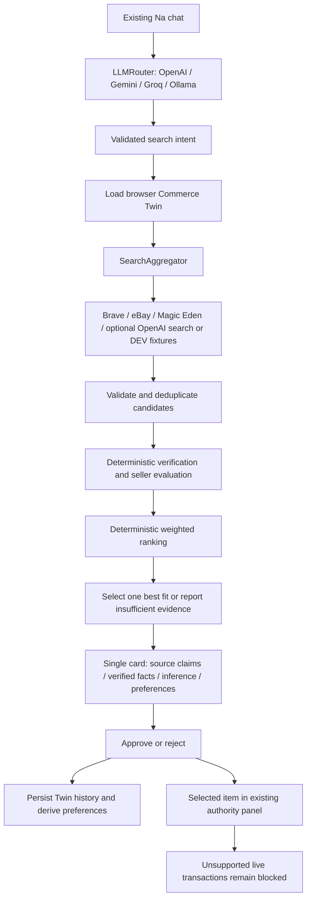

# Na product research

This extends the React/Vite chat, Express application/adapters, shared Zod contracts and existing Phantom/Anchor authority workflow. No wallet signing or Rust/canonical proposal contract was changed. The original scenario/image demo remains available under **Search mode → Authority demo**.

## Run

From the repository root (`Gobuy/gobuy`), use Node 22.18+ or 24+:

```powershell
npm ci
if (!(Test-Path backend/.env)) { Copy-Item backend/.env.example backend/.env }
# Terminal 1
npm run dev:backend
# Terminal 2
npm run dev
```

Open `http://localhost:5173/na`. Research defaults to live sources. Configure `EBAY_ACCESS_TOKEN` for physical offers or `SERPAPI_KEY` for SerpApi Google web discovery, plus an optional LLM provider in **backend/.env**, then restart the backend. SerpApi replaces Brave in the running application and works even when AI is unavailable. Organic results become discovery leads; prices and seller facts require product-page evidence. Na supports OpenAI, Anthropic, Gemini, Groq and optional Ollama with automatic failover; follow the [LLM setup and reliability guide](NA_LLM_ROUTER.md). Missing credentials or provider failures never fabricate recommendations. To exercise synthetic fixtures, explicitly set `SEARCH_PROVIDER_MODE=mock`; try **Find headphones under 100 USD**. Existing environment files are not overwritten. No secrets belong in VITE_ variables or frontend files.

Try: **Na, find me an authentic Gundam RX-78 under 1,000,000 VND. I prefer reputable sellers and I am willing to pay slightly more for a trusted store.** Without strong authenticity evidence and a comparable VND offer, Na must decline to select. Current adapters do not supply manufacturer or platform authenticity attestations. The example is a requirement check, not a promised successful recommendation.

For NFTs, enable Magic Eden and use an explicit symbol, for example: **Find NFT listings from collection: okay_bears under 2 SOL.** The collection and current listings must exist; an empty result is legitimate. These are read-only mainnet observations, never Devnet assets.

## Architecture



`SearchProvider` is the extension point. Add an adapter and register it in `createResearchService.ts`; Na's orchestration does not change. Providers run concurrently with `Promise.allSettled`, per-provider deadlines, cancellation, bounded JSON bodies and safe error summaries. One failure does not discard another provider's results. URL normalization drops known tracking parameters while preserving product variants; duplicate web/marketplace listings prefer marketplace data without merging seller claims.

`LLMRouter` calls provider adapters through a common interface, with local Zod validation and one structured-output repair attempt. Quota, rate limits, connection failures and outages advance to another configured provider; repeated failures open a temporary circuit. Search circuits are independent. The model never returns product records or scores. Explanation generation selects valid reason indexes and a conversational opening; application code renders only supplied evidence statements. Failed optional explanations retain deterministic reasons. All-provider intent failure activates the labeled deterministic parser. Structured search bypasses all LLMs. Mock data still requires explicit mock mode. See [LLM behavior and configuration](NA_LLM_ROUTER.md).

## Providers and mode

| Adapter | Implementation | Available facts and constraints |
| --- | --- | --- |
| WebSearchProvider | **REAL** Brave search + bounded product-page retrieval | Up to 10 direct pages are read for one unambiguous JSON-LD Product/Offer. Retrieved price, model, condition, stock, seller, product ratings and business identity are source claims. Snippets never supply prices. Multi-product pages, aggregate price ranges, conflicting variant URLs, malformed data or fetch failures remain discovery leads. |
| EbayProvider | **REAL** official eBay Browse API search + item details | Up to 12 fixed-price offers enriched concurrently with a 2.5-second detail deadline. Price, seller feedback, brand/model/size, product ratings and review counts, availability/end date, returns and explicitly supported shipping countries when exposed. Summary facts survive detail failures. Net feedback is not a review count; estimated sold quantity is not an exact purchase count. |
| MagicEdenProvider | **REAL** Solana collection-listings API | Exact collection symbol, SOL listing price, mint, optional image/name/seller address. Read-only mainnet endpoint, source links attribute Magic Eden. No inferred collection or seller authenticity. |
| MockSearchProvider | **MOCK / DEV** | Synthetic request-shaped comparison examples with example.com links, labeled on the response and every card. No real offers or images. |
| Existing MockMarketplaceAdapter | **MOCK** | Original authority demo scenarios only, unchanged. |

`real` is the default. `auto` remains a compatibility alias for live adapters and never enables fixtures. Only explicit `mock` mode uses synthetic data. Live selection requires at least two retrieved live offers, a grounded price and currency, and at least one eligible candidate; search snippets and fixtures cannot satisfy that requirement. The response lists skipped/unconfigured/failed providers. A configured LLM alone does not supply live offers. Live credentials have not been tested in this implementation session; adapter tests use representative HTTP fixtures.

Official references: [Brave web search](https://api-dashboard.search.brave.com/app/documentation/web-search), [eBay Browse](https://developer.ebay.com/api-docs/buy/api-browse.html), [eBay item details](https://edp.ebay.com/api-docs/buy/browse/resources/item/methods/getItem), [Schema.org Product](https://schema.org/Product), [Offer](https://schema.org/Offer), [AggregateRating](https://schema.org/AggregateRating), [Magic Eden collection listings](https://docs.magiceden.io/reference/get_collections-symbol-listings), [Magic Eden Solana overview](https://docs.magiceden.io/reference/solana-overview), [OpenAI Structured Outputs](https://developers.openai.com/api/docs/guides/structured-outputs).

## Environment variables

All research settings are backend-only. See [backend/.env.example](../backend/.env.example). Root `.env.example` is a reference and is not automatically loaded.

| Variable | Default / purpose |
| --- | --- |
| SEARCH_PROVIDER_MODE | `real`; `auto` also uses live sources; `mock` explicitly enables fixtures |
| SERPAPI_KEY | Enables live SerpApi Google web discovery; server-only, never log request URLs containing this key |
| EBAY_ACCESS_TOKEN | Optional production OAuth application token with Browse access; renew when expired |
| EBAY_MARKETPLACE_ID | `EBAY_US` |
| MAGIC_EDEN_ENABLED | `false`; opt into real read-only NFT listings |
| MAGIC_EDEN_API_KEY | Optional provider key where access requires one |
| OPENAI_API_KEY | Optional; enables dynamic LLM intent and grounded explanation selection |
| OPENAI_MODEL | `gpt-4o-mini`; use a model supporting strict structured output |
| SEARCH_TIMEOUT_MS | `8000`, configurable 100–15000 |
| LLM_PROVIDER_ORDER | `openai,gemini,groq,ollama`; skips unconfigured providers |
| GEMINI_API_KEY / GROQ_API_KEY / OLLAMA_MODEL | Additional AI adapters; see [full settings](NA_LLM_ROUTER.md) |
| LLM_REQUEST_TIMEOUT_MS | `30000` per attempt; `LLM_TIMEOUT_MS` remains a legacy alias |
| LLM_TOTAL_TIMEOUT_MS | `120000` including AI failover/repair; explanations capped at 10000 |
| LLM_FAILURE_THRESHOLD / LLM_COOLDOWN_SECONDS | `3` failures / `60` seconds |
| TWIN_DATA_DIR | `.data/commerce-twins`, relative to backend working directory |
| APP_ORIGINS | `http://localhost:5173,http://127.0.0.1:5173`; exact frontend origins for proxy requests |
| RANKING_WEIGHTS_JSON | Optional object with productMatch=25, budgetMatch=20, sellerTrust=20, productEvidence=15, websiteTrust=10, preferenceMatch=10 |
| HOST / PORT | Existing `127.0.0.1` / `3001` API binding |

Existing public `VITE_SOLANA_*` and `VITE_ANCHOR_IDL_URL` settings still configure the Devnet authority demo. Search requires none of them. When hosting, configure the actual browser origin, a same-origin `/api` reverse proxy, and persistent private storage. Browser and backend timeouts allow two LLM calls plus a bounded search.

## Evidence and ranking

Authenticity uses VERIFIED / HIGH CONFIDENCE / MEDIUM CONFIDENCE / LOW CONFIDENCE / UNKNOWN. A conflict is recorded as a hard violation. Title claims always yield UNKNOWN. A future adapter can supply structured platform/manufacturer evidence with a source reference; VERIFIED means source-attested, not independently authenticated by GoBuy. Current live adapters do not supply such evidence. An explicit or Twin authenticity requirement therefore blocks their selection, including in mock mode.

Adapters attach field-level `evidence` with a source reference, retrieval time, statement and SOURCE_CLAIM or VERIFIED_FACT label. Source-reported prices, ratings and seller claims are not independently verified facts. Missing values remain absent in JSON and display as UNKNOWN. Seller trust is deterministic: rating up to 40 points, logarithmic review volume up to 20, source-verified seller status 20, accepted returns 10, store history 10. An eBay net feedback score may supply at most 10 volume points when reviews are absent. Missing evidence earns no points and does not assert fraud.

Hard filtering precedes scoring: known budget overruns (including known applicable shipping/fees), wrong model/brand/size/condition/compatibility/collection, unavailable offers, excluded destinations and unmet minimum seller trust cannot win. Missing required price/currency, destination, compatibility, condition or authenticity evidence also prevents selection. Budgets come only from the current request; Twin preferences never supply a maximum. Explicit current non-price requirements override Twin preferences. Transaction mandates remain a separate authority boundary.

Effective price is item price + applicable shipping + required fees, only when all components are retrieved in the same currency and destination context. Absent fees are never zero. Known costs may fit the budget while the final payable total remains UNKNOWN; the card states this uncertainty. No FX conversion or tax estimation occurs. Price research compares at least two peers with matching explicit brand, model, condition, size and currency. Relative to their median: below 60% is VERY LOW, up to 95% COMPETITIVE, up to 115% NORMAL, above 115% EXPENSIVE. Insufficient peers means UNKNOWN. VERY LOW earns zero value points and a visible risk warning; it never proves authenticity or fraud.

Default ranking dimensions are product match 25%, price/value 20%, seller trust 20%, product evidence/reviews 15%, website/marketplace trust 10%, and Twin preferences/history 10%. High seller importance multiplies seller weight by 1.5 and price weight by 0.8; high price sensitivity multiplies price weight by 1.4; weights then normalize to 100. Review evidence uses `(rating / 5) * count / (count + 50)` so 5 stars from 3 reviews does not beat 4.8 from 5,000 solely on stars. Model, condition and warranty evidence supply the remaining product evidence points. Review text/recency/distribution are not retrieved by current adapters and are not inferred.

Website/marketplace assessment is separate from seller assessment. Supported evidence covers business identity, contact, returns, payment methods, independent reputation, authorized retailer status and buyer protection. Positive confidence requires independently supported signals; HTTPS and presentation earn no points. Current adapters cannot independently verify website reputation, so this dimension stays UNKNOWN. Manufacturer cross-checks, independent review services and direct website policy retrieval remain future adapter integrations.

For NFT collection requests, an exact match to the queried collection endpoint establishes search relevance even if individual token titles omit the collection name. It does not establish authenticity.

History match uses recorded decisions about the same source/seller in the same real/mock mode. Preferred trust premiums compare cheaper, relevant candidates in the same currency and kind. Ties use stable candidate IDs. Neither trust nor ranking uses model-generated numbers.

## Commerce Twin and decisions

An HttpOnly, SameSite=Strict opaque cookie identifies an **anonymous browser profile**, independently of Phantom. The server hashes the token for storage filenames and writes one atomic JSON file per profile. Settings and the newest 200 decision snapshots persist across server restarts; searches are held only in memory (15 minutes, newest 10 per profile, 500 globally). There is one active search per profile and at most 20 globally. A production deployment needs authenticated profiles, retention controls and durable transactional database storage behind `TwinStore`.

Explicit settings override learned values. Transparent rules, derived from real-item decisions only:

- At least three “Too expensive” rejections increase price sensitivity.
- At least three approvals with trust ≥60 or “Seller not trusted” rejections increase seller importance.
- At least three approvals choosing stronger sellers at a measured premium ≤5% establish the mean accepted premium, capped at 5%.

Mock history is visible but never trains preferences for real purchases. No embeddings, vector database, fine-tuning or ML training is used. Raw request text/images are not written to Twin storage, though selected item titles can reflect a development request. Configured external services receive the search text/query; the explanation model receives only computed reasons and candidate IDs.

Decision requests contain only search ID, candidate ID, outcome and optional reason. The backend resolves source facts from its own session-bound cached recommendations. Cross-session references, forged fields and expired decisions fail. Repeated identical decisions are idempotent; changing an already saved decision requires a new search. Persistence occurs before the success response/handoff.

**Approve → authority review is implemented. Purchasing is not.** `createResearchHandoff` passes the exact selected CandidateItem to the existing authority panel with explicit blockers. The current canonical/Anchor contract accepts only demo marketplaces and Devnet SOL lamports. Physical offers, live SOL NFTs, fiat prices and synthetic fixtures are never coerced into that contract. The LLM has no transaction tool; no backend wallet exists. Existing Phantom-signed demo proposals and audit records still work as before.

## API

| Endpoint | Body / response |
| --- | --- |
| POST /api/research/search | `{ "text": "Find headphones under 100 USD" }` → intent, zero or one selected card, researched/eligible counts, provider status, mode, expiry, Twin |
| GET /api/research/twin | Establishes browser cookie; returns explicit/learned/effective preferences and history |
| PATCH /api/research/twin | Replaces explicit preferences; `{}` returns to learned/default preferences |
| POST /api/research/decisions | `{ "searchId": "...", "candidateId": "...", "outcome": "approve" }` or reject with optional supported reason → saved decision, Twin, approval review handoff |
| POST /api/proposals/search | Existing authority demo API, unchanged |

Research supports text only. Images remain available in the authority demo. External responses and API outputs pass Zod validation. API endpoints are fixed in code, use HTTPS, forbid redirects, cap response size and take timeout signals. Search-discovered HTML pages use a separate reader: public HTTPS only, validated IPv4 DNS answers pinned to the connection, no connection pooling, a 1 MB body cap and a 2-second deadline. Private/special addresses, redirects, compressed bodies, credentials and arbitrary user/model URL fetches are rejected. IPv6-only sites, blocked sites and pages requiring JavaScript remain leads. No scripts or subresources run; only JSON-LD is parsed. External images are display-only. Errors expose no keys, provider bodies or stack traces; retrieved HTML is never rendered as markup.

## Validation

Run the checks below after changes. Provider calls in tests are fixtures; no paid/live API credentials are used. Windows sandbox restrictions on tsx account lookup and Vite configuration resolution can require execution outside the sandbox.

Regression cases cover single selection, hidden-candidate approval rejection, unavailable/wrong/unknown requirements, shipping/fee context, exact model matching, sparse reviews, website evidence, anomalous prices, direct product-page extraction and private-address rejection. The [router tests and verification guide](NA_LLM_ROUTER.md) adds automatic failover, context protection, circuit recovery, structured repair and immutable spending-limit coverage.

Run `npm run lint` (the repository's strict TypeScript check), `npm test`, and `npm run build`. For browser checks, set `$env:PLAYWRIGHT_CHANNEL = 'msedge'` and run `npm run test:e2e`. Browser tests start an explicit mock research backend, disable paid LLM calls, and isolate their Twin files under `.data/e2e-commerce-twins`. They use separate ports 3101/5273 so an existing development server is not reused; override with `PLAYWRIGHT_API_PORT`/`PLAYWRIGHT_WEB_PORT`. Vite's server-only `GOBUY_API_URL` selects the test proxy target. Run builds before browser tests: rebuilding shared outputs while the watch server runs can restart it mid-test.

Node tests cover dynamic/invalid intent, provider adapters, response size, cancellation/failures, deduplication, URL validation, authenticity, rating semantics, deterministic ranking, hard budgets, grounded explanations, learning overrides, persistent concurrent writes, session isolation, origin checks, forged/expired/idempotent decisions and the blocked transaction handoff. Browser tests cover cards, decisions, reload persistence, settings, mobile width, errors, original demos and Phantom stubs. No live-provider success, real Phantom transaction, deployment or purchase is claimed by these tests.

## Current limits and next step

Live-provider account access must be configured and tested; eBay token refresh is manual. Web pages without an unambiguous structured offer remain leads. Magic Eden requires an exact symbol. Fresh SOL conversion and purchase revalidation exist, but the production authenticated merchant/payment adapter is not connected; unknown fees/taxes or destination costs block spending. Shipping quotes are used only when the response explicitly matches the requested destination; broad shipping regions and local exclusions remain unresolved. Deterministic spending parsing supports limited explicit English/Vietnamese numeric phrases. Twin storage and router circuits are single-process, not wallet authentication or a production multi-user database. Existing on-chain authority cannot approve live shopping assets.

Next: validate live marketplace credentials, add trusted manufacturer/retailer cross-checks and destination-specific checkout totals, and integrate independent website reputation evidence. A supported purchase contract still needs fresh offer checks and explicit wallet/user authorization before execution.

## File inventory

Created:

- `shared/src/research.ts`
- `backend/src/adapters/llm/StructuredLLMProvider.ts`
- `backend/src/application/NaResearchService.ts`, `createResearchService.ts`
- `backend/src/http/routes/research.ts`
- `backend/src/services/ai/intentExtractor.ts`, `explainRecommendations.ts`
- `backend/src/services/search/SearchProvider.ts`, `SearchAggregator.ts`, `WebSearchProvider.ts`, `EbayProvider.ts`, `MagicEdenProvider.ts`, `MockSearchProvider.ts`, `http.ts`, `productPage.ts`
- `backend/src/services/verification/sellerEvaluator.ts`, `verifyCandidates.ts`, `evidence.ts`, `priceResearch.ts`, `websiteEvaluator.ts`
- `backend/src/services/ranking/rankCandidates.ts`
- `backend/src/services/twin/CommerceTwinService.ts`, `TwinStore.ts`
- `backend/src/services/approval/researchHandoff.ts`
- `frontend/src/services/api/research.ts`
- `frontend/src/features/na/components/ResearchResults.tsx`, `CommerceTwinPanel.tsx`
- `backend/tests/research.test.ts`, `frontend/e2e/research.spec.ts`
- `docs/NA_RESEARCH.md`

Modified:

- `shared/src/index.ts`
- `backend/src/app.ts`, `config/env.ts`, `server.ts`, `backend/.env.example`, `backend/README.md`
- `frontend/src/features/na/NaWorkspacePage.tsx`, `components/AuthorityPanel.tsx`, `domain/types.ts`, `hooks/useAuthority.ts`, `na.css`
- `frontend/e2e/workspace.spec.ts`, `frontend/README.md`, `playwright.config.ts`
- `.env.example`, `.gitignore`, `README.md`, `docs/PROJECT_MAP.md`

No new dependencies, Rust edits, canonicalization changes, or replacement of existing marketplace/LLM demo adapters.

See [Architecture v2](NA_ARCHITECTURE_V2.md) for the current PurchaseIntent, extension, Ondo feed, action log, and no-price mandate contracts.
