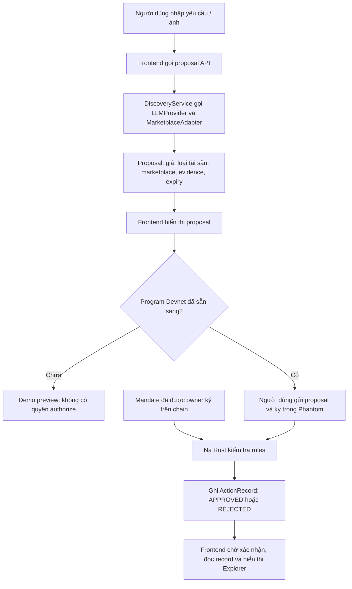

# GoBuy: flow và bản đồ file

## Mục tiêu của bản MVP

Bạn đặt giới hạn trước. Agent tìm và đưa ra đề xuất. Na kiểm tra đề xuất có nằm trong giới hạn đó không.
Trong bản này, APPROVED nghĩa là **proposal đáp ứng mandate**, không có nghĩa là đã mua tài sản.

Ví dụ: mandate cho phép NFT từ DEMO_MARKET, giá tối đa 0.2 Devnet SOL, có seller claim.
Proposal 0.17 SOL có thể qua; proposal 0.28 SOL bị từ chối vì PRICE_EXCEEDED.
Seller claim là dữ liệu đầu vào từ adapter, không phải seller đã được blockchain chứng thực.

## Ba bước độc lập

1. **Kết nối ví:** Chrome gọi Phantom để xin public address. Không cần backend, program ID, Devnet SOL hoặc ký transaction.
2. **Tìm đề xuất:** frontend gửi text/ảnh tới backend; adapter trả proposal. Mặc định dùng dữ liệu mẫu, chưa có AI hiểu text/ảnh.
3. **Kiểm tra on-chain:** cần program đã deploy. Người dùng ký mandate, rồi ký gửi proposal. Rust tính verdict và ghi audit; UI đọc kết quả sau xác nhận.

Hiện bước 1 có code kết nối extension, bước 2 chạy được. Bước 3 có source nhưng chưa deploy/test bằng ví thật.
Khi chưa cấu hình bước 3, app chỉ cho xem local rule preview và lịch sử demo; không tạo tx signature.

## Khi không kết nối được Phantom

Thông báo “Phantom was not detected” nghĩa là trang chưa nhận provider của extension; chưa liên quan tới Devnet program.
Kiểm tra Phantom đã được cài và bật trong đúng Chrome profile, mở/mở khóa extension, cho phép truy cập trang rồi reload localhost.
Chỉ cài Phantom trên điện thoại không cung cấp provider cho Chrome desktop. Bản này chưa hỗ trợ kết nối điện thoại bằng QR/WalletConnect.
Cài từ [website Phantom chính thức](https://phantom.com/). Cơ chế provider theo [tài liệu Phantom](https://docs.phantom.com/solana/detecting-the-provider).
Kết nối thành công sẽ hiển thị “Connected: …” và nút Disconnect ngay cả khi program chưa deploy.

## Frontend: phần hiển thị và ví

| File / nhóm file | Vai trò |
| --- | --- |
| src/main.tsx, src/app/App.tsx | Khởi động React và các đường dẫn /na, /na/mandate, /na/activity |
| src/features/na/NaWorkspacePage.tsx | Ghép màn hình, nhập yêu cầu/ảnh, gọi discovery và hiển thị proposal |
| components/AuthorityPanel.tsx | Hiển thị mandate, bảng rule preview hoặc kết quả đọc từ chain |
| components/MandateForm.tsx | Form chỉnh giới hạn; lưu demo hoặc yêu cầu ký mandate |
| components/ActivityHistory.tsx | Lịch sử demo và audit on-chain, phân biệt rõ hai loại |
| hooks/useAuthority.ts | Quản lý trạng thái ví, mandate, ký/đợi kết quả, lỗi và đổi tài khoản |
| domain/types.ts | Kiểu Message dùng cho hội thoại |
| src/services/api/client.ts | Gọi API /api/proposals/search và kiểm tra response |
| src/services/solana/phantom.ts | Nhận extension Phantom và xin kết nối ví |
| src/services/solana/client.ts | Tạo instruction Anchor, gửi transaction, đọc mandate và ActionRecord |
| src/services/solana/confirmation.ts | Không cho coi transaction chưa xác nhận/lỗi là thành công |
| src/services/solana/network.ts | Kiểm tra RPC thực sự là Devnet |
| src/services/solana/links.ts | Tạo link Solana Explorer với cluster=devnet |
| na.css, shared/styles/global.css | Giao diện GoBuy và responsive |
| public/demo/*.svg | Ảnh mẫu hiển thị trong proposal |
| vite.config.ts | Cấu hình React/Vite và proxy API tới backend |
| src/vite-env.d.ts | Khai báo TypeScript cho biến môi trường Vite |

File services/demoAgent.ts cũ chỉ chuyển tiếp một import, đã bỏ; màn hình gọi API client trực tiếp.

## Backend: chỉ tìm và chuẩn hóa đề xuất

| File / nhóm file | Vai trò |
| --- | --- |
| src/server.ts | Mở HTTP server |
| src/app.ts | Ghép Express, health endpoint, routes, giới hạn JSON và error handler |
| src/config/env.ts | Đọc/kiểm tra HOST và PORT |
| src/http/routes/proposals.ts | Khai báo URL POST /api/proposals/search |
| src/http/controllers/proposals.ts | Nhận request → kiểm tra input → gọi service → trả JSON |
| src/schemas/search.ts | Kiểm tra text, dung lượng ảnh, MIME/magic bytes |
| src/application/DiscoveryService.ts | Điều phối việc diễn giải yêu cầu và tìm proposal |
| src/adapters/llm/LLMProvider.ts | Interface cho bộ hiểu yêu cầu; mock hiện chỉ chuyển text/scenario, chưa gọi LLM |
| src/adapters/marketplace/MarketplaceAdapter.ts | Interface chung để sau này nối API marketplace chính thức |
| src/adapters/marketplace/MockMarketplaceAdapter.ts | Tạo proposal mẫu, UUID mới và expiry |

Backend không có database hiện tại, không lưu mandate có thẩm quyền, không giữ ví và không cấp verdict authorize.

## Shared và Anchor

| File / nhóm file | Vai trò |
| --- | --- |
| shared/src/contracts.ts | Định nghĩa và kiểm tra CommerceProposal, mandate, ảnh, reason codes |
| shared/src/canonical.ts | Mã hóa dữ liệu theo một thứ tự cố định rồi SHA-256 để JS và Rust hiểu cùng proposal |
| shared/src/preview.ts | Kiểm tra rule để giải thích trên UI; không cấp quyền on-chain |
| shared/src/index.ts | Điểm export của package shared |
| shared/canonicalization/README.md | Đặc tả byte/hash; hữu ích khi sửa contract, không phải code chạy |
| anchor/programs/gobuy_na/src/lib.rs | Instructions, owner/PDA constraints, state, hash và ghi audit |
| anchor/programs/gobuy_na/src/rules.rs | Logic kiểm tra rules xác định; không gọi AI |
| anchor/Anchor.toml | Cấu hình Anchor, chỉ Devnet; địa chỉ hiện tại là sentinel chưa deploy |
| anchor/Cargo.toml, programs/gobuy_na/Cargo.toml | Rust workspace và dependency của program |
| anchor/Cargo.lock | Khóa phiên bản Rust dependency để build tái lập |
| scripts/configure-anchor.mjs | Điền public program ID thực tế vào Rust và Anchor.toml; không deploy |
| scripts/copy-idl.mjs | Copy IDL do Anchor build sinh ra để frontend biết cách gọi program |

Hash giúp phát hiện dữ liệu bị thay đổi; không biến giá/seller do adapter khai báo thành sự thật đã xác minh.

## Cấu hình và tests có cần không?

| File / nhóm file | Vai trò |
| --- | --- |
| package.json ở root và mỗi workspace | Dependency, lệnh dev/build/test; cần để chạy dự án |
| package-lock.json | Khóa npm dependency; nên giữ |
| tsconfig.json ở mỗi workspace | Cấu hình TypeScript; cần build |
| tsconfig.tests.json | Chỉ kiểm tra kiểu của test source |
| .env.example | Mẫu các biến cấu hình; không phải secret và không tự được app nạp |
| .gitignore | Tránh đưa dependency, build output và secrets vào Git |
| README.md và README của workspace | Hướng dẫn sử dụng, không chạy trong app |
| shared/tests/contracts.test.ts | Kiểm tra số nguyên, schema và hash |
| backend/tests/api.test.ts | Kiểm tra API, giới hạn ảnh/request và lỗi |
| frontend/tests/*.test.ts | Kiểm tra Devnet guard và confirmation |
| frontend/e2e/workspace.spec.ts | Tự mở browser, thao tác UI, kiểm tra flow và ví mô phỏng |
| playwright.config.ts | Chỉ cấu hình bộ test browser: URL, browser, mở frontend/backend, lưu trace khi lỗi |
| anchor/tests/authorization.test.ts | Test program thật trên Devnet khi bật rõ ràng và đã deploy |
| anchor/programs/gobuy_na/src/hash_tests.rs | Rust test đối chiếu hash với TypeScript; không có trong release program |

**Playwright không kết nối ví thật hộ bạn, không deploy và không nằm trong app production.** Chỉ chạy khi gọi npm run test:e2e.
Tests có thể bỏ về mặt chạy app, nhưng sẽ mất khả năng phát hiện lỗi quyền owner, hash, replay hoặc UI.
Nếu bỏ Playwright phải bỏ cả frontend/e2e, playwright.config.ts, dependency @playwright/test, script test:e2e và mục liên quan trong tsconfig.tests.json.
Mặc định vẫn giữ tests, đã dọn các README giữ chỗ một dòng và import trung gian dư để cây source dễ đọc hơn.
